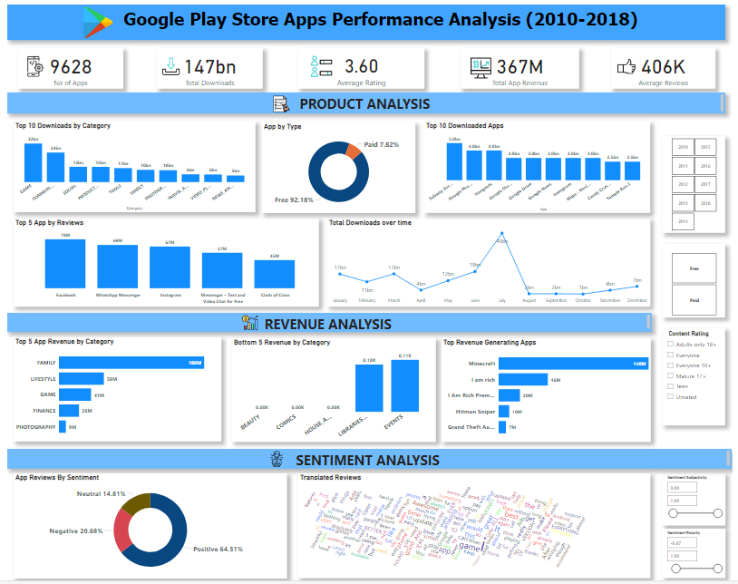

# (GOOGLE PLAYSTORE APPS ANALYSIS & VISUALIZATION)

## Table of contents

- [About](#about)
- [Project Description](#project-description)
- [Dataset](#dataset)
- [Research Questions](#research-questions)
- [Links](#links)
- [Built with](#built-with)
- [Key Insights](#key-insights)
- [Contributors](#contributors)
  -[Team Anchor](#team-anchor)
- [Acknowledgements](#acknowledgements)

## About

In this project, I'd be will be working on a real-world dataset of the google play store, one of the most used applications for downloading android apps. This project aims on cleaning the dataset, analyze the given dataset, and mining informational quality insights. This project also involves visualizing the data to better and easily understand trends and different categories.

## Project Description

This project will help one understand how a real-world database is analyzed using SQL, how to get maximum available insights from the dataset, pre-process the data using python for a better upcoming performance, how a structured query language helps us retrieve useful information from the database, and visualize the data with the power bi tool. The Project will consist of 2 modules:

Module 1: Pre-processing, Analyzing data using Python and SQL.

Module 2: Visualizing data using Power BI.

## Dataset

- This **[data set](https://drive.google.com/file/d/19fVBgoQJr5jkupe0O9Ht8VeMqSVaBJae/view?usp=share_link)** contains two csv  files of data scraped from google play store app for the period of 2010 - 2018.  The first dataset - `apps` contains data on play store apps and its attributes, while the other dataset - `reviews` containing data on customer reviews for each playstore app.  

- Key variables in the dataset includes :

**apps dataset**

| variables | Details |
| --------------------- | ---------------------- |
| App | google play store app name |
| Category | such as ART_AND_DESIGN', 'AUTO_AND_VEHICLES', 'BEAUTY' etc.|
| Rating | app rating on a scale of 1-5 |
| Reviews | the number of reviews given by users for app |
| Size | the size of the app in KB or MB |
| Installs | total installs or downloads of the app |
| Type | is it free or paid ?|
| Price | amount charged for the app in $ |
| Content Rating | such as 'Everyone', 'Teen', 'Everyone 10+', 'Mature 17+', 'Adults only 18+', 'Unrated |
| Genres | such as 'Auto & Vehicles', 'Beauty', 'Books & Reference', 'Business','Comics', 'Communication', 'Dating' etc. |
| Last Updated | the date the app was last updated |
| Current Ver | the current version of the app |
| Android Ver | the minimum android version app can run on |

**reviews dataset**

| Variables | Details |
| --------------------- | ---------------------- |
| App | google play store app name |
| Translated Review | reviews of app per each user  |
| Sentiment | positive, negative or neutral |
| Sentiment_Polarity |  polarity score based on user reviews | 
| Sentiment_Subjectivity | subjectivity score based on user reviews |

## Research Questions

Understand the following requirements and query the dataset using MYSQL for displaying the required solution:

1. Which apps have the highest rating in the given available dataset?

2. What are the number of installs and reviews for the above apps? Return the apps with the highest reviews to the top.

3. Which app has the highest number of reviews? Also, mention the number of reviews and category of the app

4. What is the total amount of revenue generated by the google play store by hosting apps? (Whenever a user buys apps  from the google play store, the amount is considered in the revenue)

5. Which Category of google play store apps has the highest number of installs? also, find out the total number of installs for that particular category.

6. Which Genre has the most number of published apps?

7. Provide the list of all games ordered in such a way that the game that has the highest number of installs is displayed on the top (to avoid duplicate results use distinct)

8. Provide the list of apps that can work on android version 4.0.3 and UP.

9. How many apps from the given data set are free? Also, provide the number of paid apps.

10. Which is the best dating app? (Best dating app is the one having the highest number of Reviews)

11. Get the number of reviews having positive sentiment and number of reviews having negative sentiment for the app 10 best foods for you and compare them.

12. Which comments of ASUS SuperNote have sentiment polarity and sentiment subjectivity both as 1?

13. Get all the neutral sentiment reviews for the app Abs Training-Burn belly fat 

14. Extract all negative sentiment reviews for Adobe Acrobat Reader with their sentiment polarity and sentiment subjectivity
 

### Links

#### Solution URL: 

- [Project Report - Module 1_Python](./PLAYSTORE_APPS_ANALYSIS.ipynb)
- [MySQL Queries - Module 1](./module 1_subtask4.txt)
- [Power BI Report - Module 2](https://www.novypro.com/project/henry-okam-4)
- [Module 1 Python/SQL Walkthrough Youtube Video](https://youtu.be/kgyO6Oah3Wk)
- [Module 2 Power BI Walkthrough Youtube Video](https://youtu.be/9cIqEtfOem4)

### Built with

- SQL (MYSQL)
- Power BI
- Excel
- Python (Pandas, Numpy)

## Key Insights

- Google play store apps generated a total revenue of $147 billion between 2010-2018.

- Calculator app generated the highest revenue of all play store apps within the period in question.

- 92% of all apps on google play store are free whilst only 8% of all apps are paid apps.

- Subway Surfers has the highest downloads of any app within the period with 5billion downloads.

- Apps in the Game and Communication category tend to have a higher download than those in other categories.

- The average rating given to apps on google play store is in the region of 3.6 while the average reviews per app is 406,000 reviews.

- Facebook, WhatsApp, and Instagram top the chart on the highest reviews for its app on google play store.

- Google play store apps saw an unprecedented increase in the number of downloads of its app in 2018 whilst generating a much higher revenue than other years within the period.

- Apps in the family and game category generated more revenue than other apps whilst apps in the beauty, comics, house & homes categories generated the least revenue within the period.

- In terms of reviews on apps, only 61% of apps received a positive review, 23% received a negative review and 17% received a neutral review from users.

## Contributors

### Team Anchor

1. Henry Okam - [Email](mailto:hnry_ugo@yahoo.com) | [Linkedin](https://www.linkedin.com/in/henry-okam)

2. Umebosi Chisom - [Email](mailto:chizky04@gmail.com) | [Linkedin](https://www.linkedin.com/in/umebosi-chisom-0b7174b8)

3. PRINCE BOADI - [Email](mailto:oseiakwasiprince@gmail.com) | [Linkedin](https://www.linkedin.com/in/princeboadi)

4. Chinazor Idenyi - [Email](mailto:idenyichinazor@gmail.com) | [Linkedin](https://www.linkedin.com/in/chinazor-idenyi)
 
5. Chidubem Anyali - [Email](mailto:dubbieanne@gmail.com) | [Linkedin](https://www.linkedin.com/in/chidubem-anyali-900834156)

## Acknowledgements

Special thanks to [Aditya Sharma](https://www.linkedin.com/in/aditya-hicounselor) and to the team at [HiCounselor](https://www.linkedin.com/company/hicounselor/) for organizing the live data analysis project and for providing the dataset for this project. Also to my team members who contributed immensely to the success of this project.It was a great learning experienece especially with regards to working in a team of analysts across different timezones.

 

